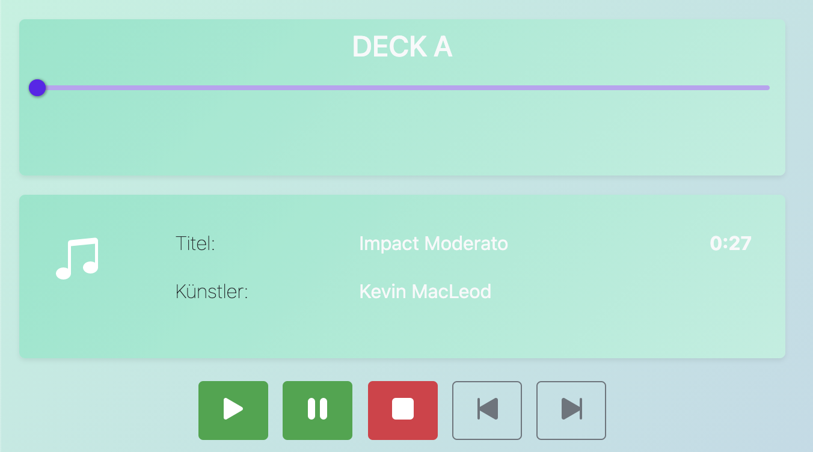

# Manual

<strong>Table of Contents</strong>

<!-- toc -->

- [What exactly is our *DJtool*?](#what-exactly-is-our-djtool)
- [User interface](#user-interface)
- [How to ?](#how-to-)
  * [play a song](#play-a-song)
  * [seek a song](#seek-a-song)
  * [change the playlist](#change-the-playlist)
  * [change the volume](#change-the-volume)
  * [change the tempo](#change-the-tempo)
  * [set the fading](#set-the-fading)
  * [set the equalizer](#set-the-equalizer)
  * [activate effects](#activate-effects)

<!-- tocstop -->

## What exactly is our *DJtool*?

- parallel playback of 2 sound tracks
- music editing with effects, tempo, volume, fading, equalizer
- setting and modification of playlists
- adding own mp3 files
- using Freesound library

## User interface
- 2 decks
  - Each deck has its audio player that shows the current song
- master area
  - for manipulating volume, tempo and fading
- music visualisation as a bar graph
- slider for seeking a song to a certain point
- playlist/effect window
  - change playlist, add effects, set the equalizer
- library window
  - delete/add/search songs

## How to ?
### play a song
- toggle play/pausing button for playing/pausing
- stop button resets the current song to the beginning
  - resets also effects, equalizer and tempo
- skip next/previous plays the next/previous song
    - activated effects and equalizer will be adopted
    - no end/beginning - endless looping of a playlist

<!-- smaller alternative:

-->

### seek a song
- manipulating the slider will lead you to the chosen point in a song

### change the playlist
- change the order by dragging the songs
- adding and deleting of songs only possible in the library window
- **ADD A SONG**
  - library
    - under the tab **Bibliothek**
    - through dragging a song from the library list into the list **Deck A** or **Deck B**
    - a song can be added often
  - own mp3
    - under the tab **Mp3 importieren**
    - select an .mp3 file from the file explorer
    - click upload
    - song will be available under the tab **Bibliothek** in the list **Bibliothek** after the upload
    -  drag the uploaded song from the library list into  **Deck A** or **Deck B**
  - Freesound
    - under the tab **Freesound Suche**
    - search for a song with any term
    - 15 songs will be shown fitting to your search term
    - if you like a song, then click on the **ADD** button
    - applications needs some seconds for uploading the chosen song
    - afterwards the song will be available under the tab **Bibliothek** in the list **Bibliothek**
    -  drag the uploaded song from the library list into  **Deck A** or **Deck B**
- **DELETE A SONG**
  - library
    - under the tab **Bibliothek**
    - click the **trash** button within the **BIBLIOTHEK** list
    - song wont be available anymore
    - ! deletes automatically from **DECK A** and **DECK B** !
  - playlist
    - click the **trash** button within the **DECK A** or **DECK B** list
    - wont be available anymore in the playlist
    - can be added again through dragging from the **Bibliothek** list
- **CHANGE ORDER**
  - change the order of list **DECK A** or **DECK B** through dragging

### change the volume
- in the master area: slide up for increasing the volume, slide down for decreasing the volume
- **L** is for the **left** deck
- **R** is for the **right** deck
- **M** is for the **mastervolume**
### change the tempo
- in the master area: slide up for increasing the speed, slide down for decreasing the speed
- **L** is for the **left** deck
- **R** is for the **right** deck
### set the fading
- this is a **non-linear crossfader**
- on default: centered and balanced
- **slide** to the **left** to fade into the left deck or to **right** to fade into the right deck
### set the equalizer
- enable the equalizer in the checkbox under the tab **Equalizer**
- **slide up or down** at the chosen frequency
### activate effects
- under the tab **Effekte**
- switch an effect on or off by **toggling the buttons**
- effects can be activated all at once
